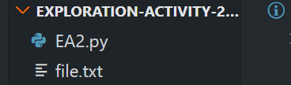
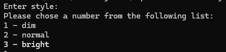
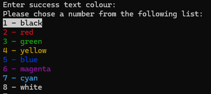
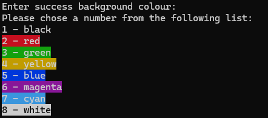
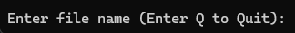
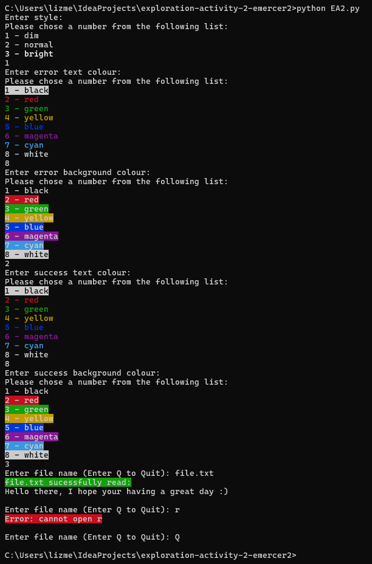

# Exploration Activity 2 Readme - Colorama

## 1. Which package/library does the sample program demonstrate?
In exploration activity 2, I demonstrate features offered by the most recent version of the python library Colorama.

## 2. How does someone run your program?
For this program please ensure you have [python](https://www.python.org/downloads/) installed on your computer before performing the following steps. 
First download the code from [the GitHub repository](https://github.com/CS2613-WI24-FR01B/exploration-activity-2-emercer2).
There are two files to note in this repository, (1) The python program, and (2) An example text file that can be used to test the program.   
 To run the python program you will need to install colorama using pip install in the terminal, 'pip install colorama'. 
 After that you can run the program through the terminal using 'python EA2.py'. From there simply respond to the prompts given by the program.

## 3. What purpose does your program serve?
This program allows Windows users to experiment with coloured text through the terminal. My program asks the users to set the text colour, style, and background colour they would like for success and error messages. Then the program tries to open a given file and uses the colours specified when printing if the file was successfully opened.

## 4. What would be some sample input/output?
The program will walk you through setting the style and colours for error and success messages text and background. There are one style and four colours for the user to set, error text, error background, success text, and success background. 
The style prompt looks like this: 

Each colour has a similar prompt to one of the following: 
 
The expected input is one of the 8 numbers listed, if input does not match the user will be prompted again.  
After the style and all four colours are selected the user will be asked to give a file name. 
 
If the file name exists in the directory a success message and the file contents are printed in the appropriate colours. 
Otherwise a error message will appear with the appropriate colours applied. 
Either way the user will then be asked be asked to enter another file name until they enter "Q" as the file name.  
For example, if the numbers 3, 8, 2, 8, 3 (style, error text, error background, success text, success background) were chosen before entering a file name, errors should appear with white text and a red background and success messages should appear with white text and a green background. 
